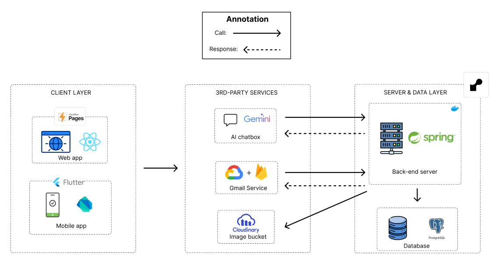
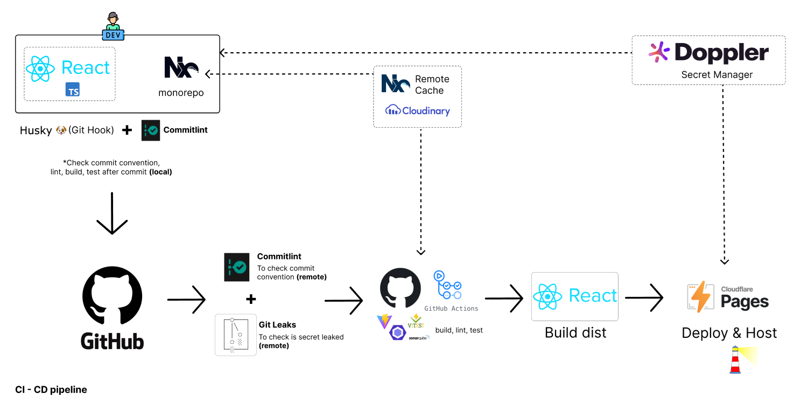

# fe-swd

Frontend Nx monorepo phuc vu bai tap nhom EXE cua FPTU. Ung dung chinh la React + Vite + Tailwind trong `apps/fe-react-web`, kem mock API Express o `apps/mock` de ho tro phat trien.

## System Architecture Diagram (SAD)

File goc: `apps/fe-react-web/src/doc/sad.png`.

## CI/CD pipeline

- GitHub Actions chay tren moi PR vao `main`: kiem tra branch name dang `<type>/<slug>`, cai `pnpm`, chay `nx lint` va `nx build` cho toan workspace.
- Nhanh hop le: `feature/`, `bugfix/`, `hotfix/`, `release/`, `chore/`, `codex/`.
- Merge chi duoc thuc hien khi lint/build pass de dam bao `main` luon xanh.

## Cai dat va chay

- Yeu cau: Node 20+ va `pnpm` 10.x (khoa tai `packageManager`), khong can cai Nx global.
- Cai dependencies: `pnpm install`.
- Chay dev frontend: `pnpm dev` (Nx dev cho `fe-react-web`), mac dinh Vite se mo tren cong do Nx gan.
- Build production: `pnpm build`; xem ban build: `pnpm preview`.
- Lint/test: `pnpm nx lint fe-react-web` va `pnpm test:ui` (Vitest UI).
- Mock API (tuy chon): `pnpm --filter @booking-group-workspace/mock dev` de bat server Express.

## Troubleshooting

- Loi cache Nx hoac cau hinh cu: `pnpm clean-nx-cache` de reset workspace data.
- Module hong sau khi doi nhanh: `pnpm clean-node-modules` roi `pnpm install`.
- Pnpm sai version: kiem tra `pnpm -v`, can chinh theo `packageManager: pnpm@10.15.1`.
- Thieu bien moi truong: chay `pnpm setup:doppler` (neu dung Doppler) hoac tu tao `.env` phu hop truoc khi build/dev.
